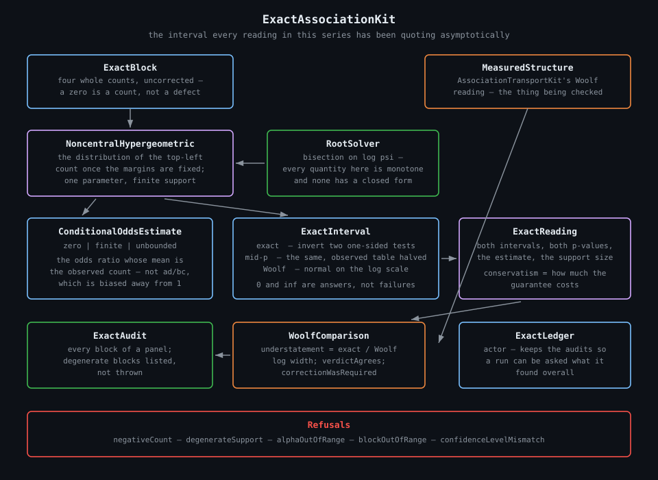
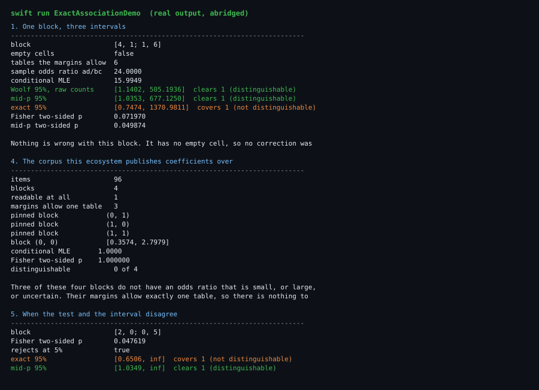
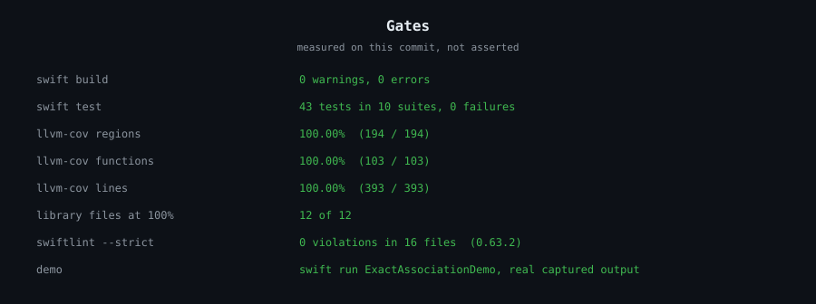

# ExactAssociationKit

Exact conditional inference for a local odds ratio: the conditional maximum likelihood estimate,
the interval you get by inverting two one-sided exact tests, its mid-p counterpart, and a
side-by-side comparison with the asymptotic interval this ecosystem has been quoting.

Part of a Swift ecosystem built around
[ProviderGatewayKit](https://github.com/rajatslakhina/foundation-model-provider-gateway). Reads the
panels and blocks that
[AssociationTransportKit](https://github.com/rajatslakhina/association-transport-kit) produces, and
answers the question that package left open about its own numbers.

- Swift 6, `Sendable` value types, one actor for the ledger.
- No dependency beyond `AssociationTransportKit`, and no floating-point counts anywhere.
- 100.00% line, region and function coverage on every file in the library target.



---

## The problem

Every odds ratio this ecosystem publishes carries a Woolf interval: the log ratio plus or minus
`1.96` times the square root of the summed reciprocals of the four counts. It is the standard
choice, it is what the applied literature uses, and it is **asymptotic** — it is a normal
approximation, and it is valid in the limit of large counts.

The panels here are not large. They have twelve items, or twenty, or ninety-six, and several of
their cells are empty. That is precisely the regime where a normal approximation on a log scale is
known to be poor, and no reading in the series has ever said by how much.

There is a second, quieter problem. Woolf's standard error is a sum of reciprocals, so a block with
an empty cell has no interval at all until something is added to every count. The series adds a
half. That repair is invisible in the output: an interval appears, it looks like every other
interval, and nothing marks it as having been manufactured.

## What this package does

Conditioning a two-by-two table on all four of its margins removes every nuisance parameter and
leaves exactly one — the odds ratio — as the noncentrality parameter of Fisher's noncentral
hypergeometric distribution. The conditional likelihood is then a one-parameter family over a
finite support, which means probabilities can be **summed rather than approximated**.

From that one fact:

| Type | What it gives you |
|---|---|
| `ExactBlock` | Four whole counts, uncorrected. A zero is a count. |
| `NoncentralHypergeometric` | The distribution of the top-left count given the margins. |
| `ConditionalOddsEstimate` | The conditional MLE — `zero`, `finite`, or `unbounded`. |
| `ExactInterval` | Exact, mid-p, or Woolf, as one comparable type. |
| `ExactReading` | Both intervals, both p-values, the estimate, the support size. |
| `WoolfComparison` | How much narrower the asymptotic interval was, and whether it changed the verdict. |
| `ExactAudit` | Every block of a panel, with the unreadable ones listed rather than repaired. |
| `ExactLedger` | An actor that keeps audits so a run can be asked what it found overall. |

## What it found

**On a twelve-item block with nothing wrong with it, the two methods disagree.**
`[4, 1; 1, 6]` has no empty cell, so no correction is involved. Woolf gives `[1.1402, 505.1936]`
and clears independence. The exact 95% interval is `[0.7474, 1370.9811]` and does not. Twelve items
is not enough for a normal approximation on a log scale, and that is the entire difference.

**Woolf is not sometimes optimistic in this range. It is optimistic on all of it.** Swept over
every two-by-two table of at most twenty items with no empty cell — a few thousand of them — the
exact interval was never the narrower of the two, and the closest any Woolf interval came to its
own exact counterpart was still **18.2% short** of it on the log scale. That sweep is a test in
this repository, not a claim in a comment.

**Three of the four blocks in this ecosystem's own corpus have no odds ratio to estimate.** The
joint table under the shared demo's three-way verdict margins is `[[36, 36, 0], [12, 12, 0], [0, 0,
0]]`. One block is readable; the other three have a zero margin, which pins them to a single table.
Nine scenarios of `llm-ecosystem-demo` compute coefficients over this fixture. Every ratio those
three blocks ever contributed was created by the half-item correction, and the one readable block
reads `[0.3574, 2.7979]` with a Fisher p of exactly `1.0000`.

**A p-value is not a shorthand for whether an interval covers 1.** On `[2, 0; 0, 5]`, Fisher's
two-sided exact test returns `0.047619` and rejects at 5%, while Fisher's own exact 95% interval is
`[0.6506, inf)` and covers independence. Both numbers are exact. The test spends its whole 5% on
one comparison; the interval spends 2.5% on each side; on a support this coarse the two budgets do
not meet.

## The two decisions this package makes explicit

**A zero needs no repair here.** The conditional estimate is defined for every block, including
blocks with three empty cells — the answer is simply `zero` or `unbounded` rather than a number.
`WoolfComparison.correctionWasRequired` marks the blocks where the asymptotic side had to invent a
count to say anything at all; on those, the comparison is not exact-versus-asymptotic but
exact-versus-invented.

**The exact interval's guarantee is not free.** A discrete support cannot place a tail probability
at exactly `0.025`, so the exact interval overshoots to the next attainable one and its true
coverage exceeds its nominal level. `ExactReading.conservatism` is that overshoot as a ratio of log
widths, and `midP` is the interval you get by counting the observed table half in each tail —
coverage right on average rather than guaranteed, and measurably narrower.

## Refusals

Everything this package will not guess at, in `ExactAssociationError`:

| Case | When |
|---|---|
| `negativeCount` | A block was handed a count below zero. |
| `degenerateSupport` | The margins allow exactly one table. Nothing to estimate, by any method. |
| `alphaOutOfRange` | A confidence level outside `(0, 1)`. |
| `blockOutOfRange` | A corner that does not name a two-by-two block of the panel. |
| `confidenceLevelMismatch` | An exact reading and an asymptotic one drawn at different levels. |
| `unknownAuditKey` | A ledger key that was never recorded. |

`degenerateSupport` is the one worth reading twice. It is not an error condition — it is the answer
for a block whose margins pin it, and `ExactAudit` collects those rather than throwing, because a
panel full of them is the interesting case.

## Install

```swift
.package(url: "https://github.com/rajatslakhina/exact-association-kit.git", from: "1.0.0")
```

## Demo

```bash
swift run ExactAssociationDemo
```

Seven scenarios over four real panels: the twelve-item disagreement, the same table shape at ten
times the items so the asymptote can be watched closing, an empty cell read both ways, this
ecosystem's own corpus, the test-versus-interval case, what the guarantee costs as the support gets
finer, and the ledger.



## Gates

Every number below was measured on this commit with the real tool, not asserted.



```bash
swift build                      # 0 warnings, 0 errors
swift test --enable-code-coverage
swiftlint lint --strict          # 0 violations in 16 files
```

## Where it sits

```
ProviderGatewayKit          routes a request across providers
  └─ ...                    the rest of the series
      └─ AssociationTransportKit   reads a panel's structure, quotes a Woolf interval
          └─ ExactAssociationKit   says how much that interval was worth
```

`AssociationTransportKit` closed the question of what structure a real panel has. It left open a
matching one, in its own words: every interval it quotes rests on a normal approximation on the log
scale, in exactly the regime where that is known to be poor, and nothing there could say by how
much. This package answers it — and the answer, on the panels this ecosystem actually uses, is
"enough to change the verdict".

## Licence

MIT. See [LICENSE](LICENSE).
